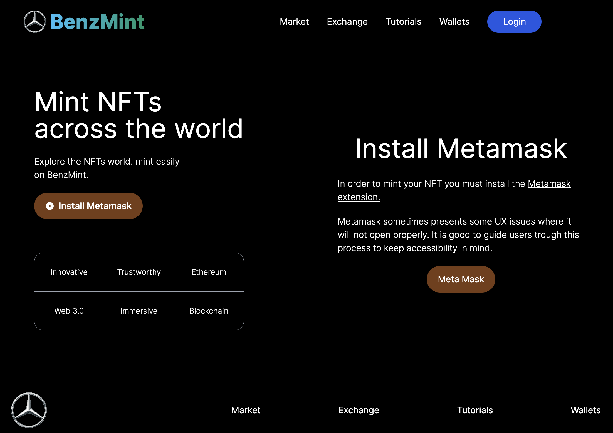
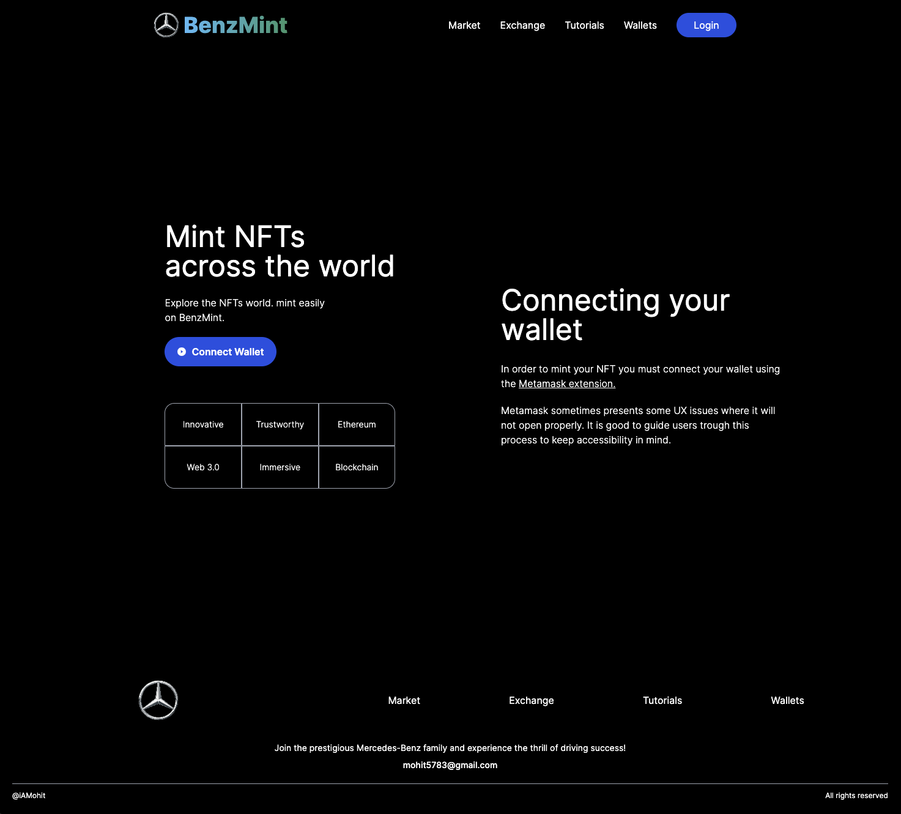
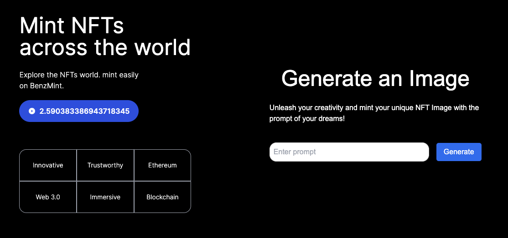
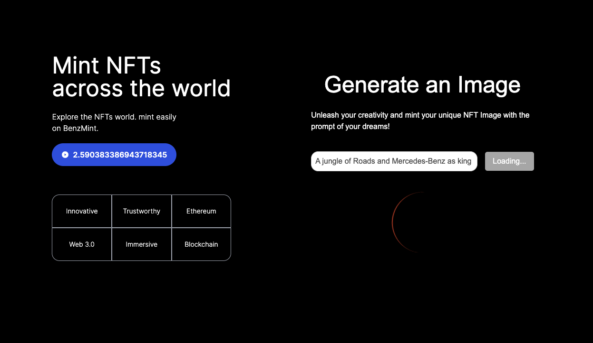
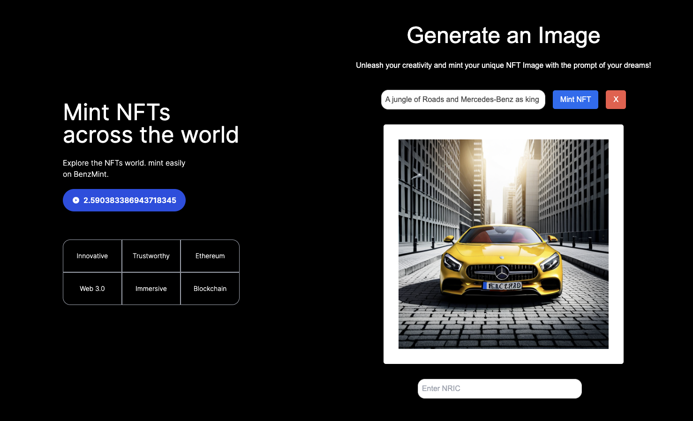

# BenzMint - Mint Your Own NFTs!

Welcome to BenzMint, a groundbreaking NFT portal that lets you explore the fascinating world of Non-Fungible Tokens (NFTs) like never before! Imagine a world where owning digital art is just as exciting as owning physical masterpieces. With BenzMint, you can now mint your own unique NFTs and showcase your artistic creations in the captivating realm of blockchain technology.

## The BenzMint Experience

At BenzMint, we have crafted an immersive and challenging experience to test your prowess in Web3.0, Full Stack development, and API creation. Our project is divided into several components and modules, each designed to ensure a seamless user experience:

1. **nric-wallet/route.ts**: Our powerful API handles the validation and insertion of NRIC and wallet addresses into the database. It also generates encrypted receipts using CryptoJS, adding an extra layer of security to your NFT minting process.

2. **text-to-image/route.ts**: The fascinating Text-to-Image API leverages the stability.ai platform to generate captivating images from user-provided prompts. These images form the core of the NFTs to be minted, making them truly unique and mesmerizing.

3. **contracts/BenzContract.sol**: Our state-of-the-art smart contract, developed and deployed for BenzMint, handles the minting process with precision. It ensures that NFTs are minted within the specified duration and follows the predefined rules for uniqueness and limitations. Each NFT is accompanied by metadata, including name, description, and image.

4. **ConnectWallet.js**: We bring the magic of Metamask to you with this component. When Metamask is not installed, the component guides you to install it seamlessly. Upon connection, the correct network is verified before granting access to the minting process.

5. **TexttoImageGenerator.js**: This is where the real excitement begins! The TexttoImageGenerator component orchestrates the entire process of generating images from text, storing them, and handling the minting process. This magical component handles everything from database interactions to image generation and minting operations.

6. **Welcome.js**: The Welcome component serves as the central hub, guiding you through the minting process. It conditionally loads ConnectWallet, Install, and TexttoImageGenerator components based on your actions, ensuring a seamless user experience.

7. **scripts/deploy.js**: To deploy the smart contract, simply run the `npx hardhat run scripts/deploy.js --network sepolia` command. This handy script eases the deployment process with a simple command.

## Running the Application

1. Clone the BenzMint repository from the [GITHUB LINK](https://github.com/mohit5783/benz-mint.git).
2. Ensure you have Node.js and npm installed on your system.
3. Install the project dependencies by running `npm install` in the root directory.
4. Set up and configure your MetaMask extension in your browser for the Sepolia test network.
5. Deploy the smart contract using the deploy script mentioned above.
6. Start the frontend by running `npm run dev` in the root directory.
7. Visit `http://localhost:3000` in your browser, and you'll be greeted by the BenzMint landing page.
8. Connect your wallet to MetaMask and start minting your own unique NFTs!

## Screenshots - Your Journey with BenzMint

   - When Metamask is not installed on your browser, BenzMint guides you to install it seamlessly, ensuring smooth NFT minting.

   - The BenzMint landing page welcomes you to the world of NFTs, setting the stage for your creative journey.

   - Connect your wallet to MetaMask and experience the thrill of owning your own NFTs.

   - Watch in amazement as BenzMint generates captivating images from your text prompts, bringing your NFTs to life.

   - Your NFTs are ready to be minted! Embrace the future of digital ownership and create your unique collection.

## Conclusion - Embrace the Future of NFTs with BenzMint

BenzMint offers a user-friendly and secure platform for minting your own NFTs. With seamless integration of Web3.0, smart contracts, and APIs, BenzMint ensures a smooth minting experience and provides a gateway to the exciting world of NFTs. The magic of turning text into captivating images for your NFTs awaits you in BenzMint!

I am proud to present BenzMint, an extraordinary project that marries technology, art, and user experience. With our seamless integration of smart contracts, APIs, and Web3.0 technologies, BenzMint opens the door to an exciting new realm of digital ownership.

The future of NFTs is bright, and BenzMint is well-positioned to be a leading player in this space. The project is still under development, but I am confident that it will continue to grow and evolve in the years to come. 

I am grateful for the opportunity to have developed BenzMint. It has been a challenging but rewarding experience, and I have learned a lot along the way. I am excited to see what the future holds for this project, and I am confident that it will make a positive impact on the world of NFTs. 

**Challenges and Lessons Learned** One of the biggest challenges I faced while developing BenzMint was integrating the different components of the project. I had to learn how to use Next.js, smart contracts, and APIs, and I had to figure out how to get all of these components to work together seamlessly. 

Another challenge I faced was debugging the project. There were many times when things didn't work as expected, and I had to spend time tracking down the errors. However, I learned a lot from this process, and I am now better equipped to debug

Embrace the future of NFTs with BenzMint, and get ready to own exclusive digital art that captivates hearts and minds alike! Let the creativity flow as you dive into the world of unique and stunning NFTs.

Are you ready to embark on this enchanting journey with me? Let BenzMint take you on a remarkable adventure into the world of blockchain-based digital art! I hope you enjoy using BenzMint and explore the limitless possibilities of NFTs! Happy minting!
